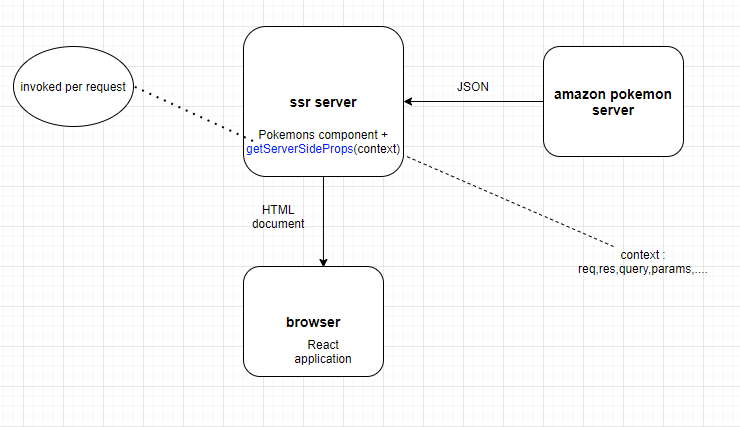

<h2>Motivation</h2>
play with server side rendering using getServerSideProps in Pokemons.tsx and PokemonDetails.tsx

<h2>Top level schema</h2>




<h2>The core idea</h2>
A page component that implement getServerSideProps (Pokemons component) fetch data and render PER REQUEST on the server and the resulting HTML is downloaded to the client !!!!!!!!!!. This looks perfect when the data is changing after build

<h3>HTML is created on the server</h3>


<h2>SSR Implementation in Pokemons.tsx</h2>

<p>This function is defined in pokemons page</p>


```ts

export async function getServerSideProps() {
  const response = await fetch(url);
  const jsonPokemons = await response.json();

  return {
    // props will be passed to the page component as props
    props: {pokemons:jsonPokemons}
  };
}
```

<p>getServerSideProps is invoked on the server and jsonPokemons is passed to Pokemons component as props. so no need for useState and useEffect in Pokemons</p>

```ts

const Pokemons = (props: {pokemons : IPokemon[]}) => {
  console.log(props);

  const elems = props.pokemons.map((pokemon) => (
    <div key={pokemon.id}>
      <div>
        {/* might use Image of next */}
        
        <h5>{pokemon.name}</h5>
      </div>
    </div>
  ));

  return (
    <div className={styles.Pokemons}>
        <h2>These pokemons are fetched using SSR function getServerSideProps</h2>
      <main className={styles.gridPokemons}>
        {elems}</main>
    </div>
  );
};

```

<h2>SSR Implementation in PokemonDetails.tsx</h2>

<h3>typescript</h3>
notice typescript intelisense


<h3>code</h3>

```ts

export const getServerSideProps: GetServerSideProps = async (context) => {
  const { pokemonId } = context.params;
  let jsonPokemonDetails;

  if (pokemonId) {
    const url = `https://jherr-pokemon.s3.us-west-1.amazonaws.com/pokemon/${pokemonId}.json`;
    const response = await fetch(url);
    jsonPokemonDetails = await response.json();
  }

  return {
    // props will be passed to the page component as props
    props: { pokemonDetails: jsonPokemonDetails },
  };
};

const Pokemons = (props: { pokemons: IPokemon[] }) => {
.....
}

```